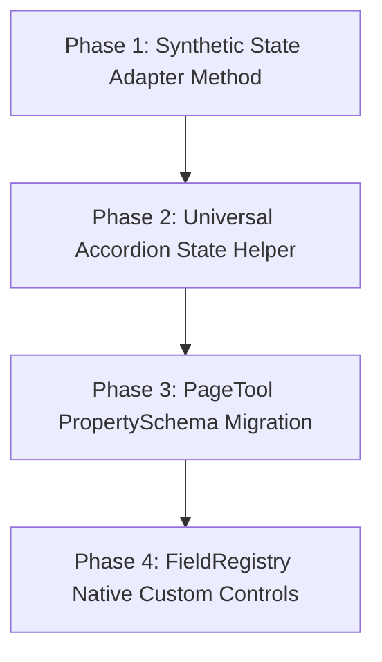

# Property Panel Architecture and Optimization Report

**Date:** August 3, 2026  
**Document ID:** `260803 - Property Panel Architecture and Optimization Report.md`  
**Target Subsystem:** CrafTools Frontend — Property Panel Infrastructure (`craftools/tools`, `PropertyRenderer.ts`, `PanelUI.ts`, `BaseTool.ts`, `Editor.ts`)

---

## 1. Executive Summary

This report provides a comprehensive architectural evaluation of the CrafTools property panel subsystem. It categorizes all 23 tool subdirectories, examines the dual rendering models currently in place, identifies architectural technical debt and state synchronization challenges, and proposes a structured 4-phase refactoring roadmap to modernize and standardize the property panel codebase across the application.

---

## 2. Tool Architecture Inventory & Categorization

The 23 tool subdirectories in `craftools/craftools/tools` are divided into three distinct architectural categories based on their construction paradigm and integration with `BaseTool` and `PropertyRenderer`.

### Summary Matrix

| Category | Tool Count | Tools | Construction Mechanism |
| :--- | :---: | :--- | :--- |
| **1. Schema-Driven Tools** | 16 | `barcode`, `curvedtext`, `emoji`, `emojikitchen`, `icon`, `image`, `lettering`, `line`, `minicalendar`, `paper`, `qrcode`, `shape`, `stamp`, `table`, `text`, `variablecontent` | Extend `BaseTool`, implement `getPropertySchema(el)`, rendered via `PropertyRenderer.render()`. |
| **2. Imperative / Legacy Tools** | 6 | `agenda`, `album`, `calendar`, `generator`, `imageslicer`, `page` | Bypass `BaseTool` schema, take over `#panel-body` imperatively via `setup()` or raw HTML, build accordions via `PanelUI.accordion()`. |
| **3. Hybrid / Special Tools** | 1 | `settings` | System-level panel tool. Does not represent a canvas element, but leverages `PropertySchema` & `PropertyRenderer` via a synthetic DOM adapter (`fakeEl`). |

---

### Detailed Categorization Breakdown

#### Category 1: Schema-Driven Tools (16 Tools)
These tools extend `BaseTool` and declaratively define their UI capabilities through a `PropertySchema` (array of `Section` and `Field` descriptors).

- **`barcode` (`BarcodeTool.ts`)**: Schema-driven properties for 1D barcodes (symbology type, barcode value, display text toggle, scale).
- **`curvedtext` (`CurvedTextTool.ts`)**: Arc angle, radius, letter spacing, text direction, and font controls.
- **`emoji` (`EmojiTool.ts`)**: Standard properties schema + dedicated `renderPickerPanel()` for inserting emojis via `EmojiPickerUI`.
- **`emojikitchen` (`EmojiKitchenTool.ts`)**: Custom `emoji-kitchen-pair` schema field querying Google Emoji Kitchen combinations.
- **`icon` (`IconTool.ts`)**: Icon color, size, rotation schema + Material Symbols / FontAwesome picker panel.
- **`image` (`ImageTool.ts`)**: Filters (brightness, contrast, saturation, blur, grayscale), border, radius, opacity, and transform matrix.
- **`lettering` (`LetteringTool.ts`)**: Decorative typography effects, color gradients, and drop shadow controls.
- **`line` (`LineTool.ts`)**: SVG line stroke width, dash patterns, endpoint markers (arrows/dots), and interactive point handles.
- **`minicalendar` (`MiniCalendarTool.ts`)**: Single-month widget layouts, day name headers, theme colors, and starting month selectors.
- **`paper` (`PaperTool.ts`)**: Canvas paper pattern fills, grid overlays, and background textures.
- **`qrcode` (`QRCodeTool.ts`)**: Multi-payload QR code schema (URL, Wi-Fi, PIX, vCard) with dynamic schema re-swapping.
- **`shape` (`ShapeTool.ts`)**: Geometric shape fills (solid/gradient/paper texture), borders, radius, and shape picker panel.
- **`stamp` (`StampTool.ts`)**: Radial badge/stamp layouts, inner/outer ring borders, central icon, and curved text.
- **`table` (`TableTool.ts`)**: Cell matrix styling (borders, padding, background colors), grid templates, and typography.
- **`text` (`TextTool.ts`)**: Standard typography formatting (font family, size, alignment, bold/italic/underline, line height, auto-fit).
- **`variablecontent` (`VariableContentTool.ts`)**: Dynamic data binding tags (`{{variable}}`), sequence numbers, dates, and business card replication.

#### Category 2: Imperative / Legacy Tools (6 Tools)
These tools do not represent single canvas elements, but act as multi-page generation wizards or system controllers.

- **`agenda` (`AgendaExportTool.ts`)**: Multi-page agenda repetition & PDF export wizard. Manages output pages, preview navigation, and export actions via raw HTML accordions.
- **`album` (`AlbumTool.ts` / `AlbumWizard.ts`)**: Photo album layout wizard. Manages template selection, photo uploading, cell styling, and grid generation imperatively.
- **`calendar` (`CalendarTool.ts`)**: Full calendar generator wizard (12-month sheets, wall/desk layouts, custom period grids).
- **`generator` (`GeneratorTool.ts`)**: Design kit generator (banner sets, promo strips, social media card suites).
- **`imageslicer` (`ImageSlicerTool.ts`)**: Multi-page image slicing tool with interactive grid overlay previews.
- **`page` (`PageTool.ts`)**: Canvas page controller. Manages page dimensions, paper orientation, background fills, and page actions via raw HTML.

#### Category 3: Hybrid / Special Tools (1 Tool)
- **`settings` (`SettingsTool.ts`)**: App configuration panel (default fonts, snap preferences, week start, auto-center). Uses `PropertyRenderer` declaratively by adapting `AppSettings` onto a synthetic detached `<div>` element (`fakeEl`).

---

## 3. Technical Findings & Architectural Inconsistencies

### A. Dual Accordion Implementation Systems
CrafTools currently maintains two parallel systems for collapsible accordion sections (`.ct-accordion`):

1. **`PanelUI.accordion()` + `PanelUI.bindAccordions()`**:
   - Generates HTML strings containing `data-accordion-id="${id}"`.
   - `bindAccordions()` queries `[data-toggle-accordion]:not([data-accordion-bound])` and marks elements with `data-accordion-bound="1"`.
   - Used primarily by Category 2 (Imperative) tools.
2. **`PropertyRenderer._createSectionEl()` + `PropertyRenderer._bindAccordion()`**:
   - Creates DOM nodes programmatically containing `data-ct-section="ct-section-${slug}"`.
   - `_bindAccordion()` binds click handlers directly during section node creation.
   - Used by Category 1 (Schema-driven) tools.

**Impact:** Both systems independently check `AppSettings.allowMultipleAccordions`, but their target selectors differ (`.ct-accordion.open` vs `[data-ct-section].open`). This duality increases codebase complexity and creates potential edge cases when switching between schema-driven tools and panel-only tools within the same `#panel-body` container.

---

### B. Accordion State Persistence in Imperative Re-renders
Imperative wizard tools (`AlbumWizard`, `CalendarTool`, `GeneratorTool`) invoke internal `renderPanel()` functions upon user interaction, replacing `#panel-body.innerHTML`. 

- **Problem:** Re-assigning `innerHTML` wipes the existing DOM, resetting expanded accordion sections (`.open`) back to default wizard states unless explicitly captured and restored.
- **Recent Remediation:** In `AlbumWizard.ts`, an explicit `Set<string>` snapshot (`prevOpen`) was introduced to capture open accordion IDs prior to `innerHTML` re-assignment and re-apply `.open` states when `allowMultipleAccordions` is enabled.
- **Systemic Need:** This preservation logic should be generalized so all imperative tools maintain expanded section states automatically.

---

### C. Multi-Source Element State (`dataset.ctState` vs `_craftoolsMeta`)
State management currently relies on two parallel representations:

1. **`dataset.ctState`**: Serialized JSON string on the element's DOM node. `PropertyRenderer` reads and writes state here directly.
2. **`_craftoolsMeta`**: JavaScript object expando attached directly to `element._craftoolsMeta`. Used by tools handling complex state structures (`ImageTool`, `QRCodeTool`, `BarcodeTool`, `LineTool`, `TableTool`).

**Risks:**
- **State Drift:** Subclasses that fail to synchronize `_craftoolsMeta` through `_applyProperty()` or `_syncFromDOM()` risk desynchronization between the property panel UI and canvas element rendering.
- **Business Card Clones:** `BaseTool._syncLinkedClones()` re-executes `_applyProperty()` across clone elements. If a tool writes state exclusively to `_craftoolsMeta` without notifying the schema layer, clone elements drift out of sync.

---

### D. `PageTool` Architectural Isolation
`PageTool.ts` manages page-level settings (Page Dimensions, Background Fill, Grid Lines, Page Actions) using imperative raw HTML strings. It bypasses `PropertyRenderer` entirely and manually manipulates `(panelBody as any)._ctRenderedElement`. This isolates `PageTool` from design system improvements made to `PropertyRenderer` and `FieldRegistry`.

---

### E. Synthetic Element Adapter Pattern
`SettingsTool.ts` demonstrates an elegant pattern for applying schema-driven rendering to non-canvas objects:

```typescript
const fakeEl = document.createElement('div');
fakeEl.dataset.ctState = JSON.stringify(SettingsTool._toCtState(cur));

PropertyRenderer.render(panelBody, SettingsTool._buildSchema(), fakeEl, (key, value) => {
  PropertyRenderer.applyChange(fakeEl, key, value);
  SettingsTool._applyChange(key, value);
});
```

While functional, instantiating temporary dummy DOM elements manually inside tools is boilerplate-heavy and can be formalized directly within `PropertyRenderer`.

---

## 4. Proposed Refactoring Roadmap

To resolve these architectural inconsistencies, the following 4-phase refactoring plan is recommended:



---

### Phase 1: Synthetic State Adapter (`PropertyRenderer.renderStateObject`)
**Objective:** Formalize rendering schemas for non-canvas objects (`SettingsTool`, `CellPanel`, `PageTool`) without requiring manual `fakeEl` DOM node instantiation.

**Implementation Plan:**
1. Add static method `PropertyRenderer.renderStateObject()`:
   ```typescript
   static renderStateObject<T extends Record<string, unknown>>(
     container: HTMLElement,
     schema: PropertySchema,
     state: T,
     onChange: (key: string, value: unknown) => void,
   ): void
   ```
2. Internally encapsulate the creation and caching of the synthetic element wrapper.
3. Refactor `SettingsTool._render()` to use `renderStateObject()`, removing boilerplate `fakeEl` instantiation.

---

### Phase 2: Universal Accordion State Helper (`PanelUI.withStatePreservation`)
**Objective:** Provide a clean wrapper for imperative tools that re-render via `innerHTML`, ensuring accordion expanded/collapsed states and scroll positions are retained automatically.

**Implementation Plan:**
1. Add `PanelUI.withStatePreservation()`:
   ```typescript
   static withStatePreservation(
     container: HTMLElement,
     renderFn: () => void,
   ): void {
     const openAccordions = new Set<string>();
     container.querySelectorAll<HTMLElement>('.ct-accordion.open[data-accordion-id]').forEach(el => {
       if (el.dataset.accordionId) openAccordions.add(el.dataset.accordionId);
     });

     renderFn();

     if (openAccordions.size > 0 && AppSettings.get('allowMultipleAccordions')) {
       container.querySelectorAll<HTMLElement>('.ct-accordion[data-accordion-id]').forEach(el => {
         const id = el.dataset.accordionId;
         if (id && openAccordions.has(id)) {
           el.classList.add('open');
         }
       });
     }
   }
   ```
2. Integrate `PanelUI.withStatePreservation()` into `CalendarTool`, `GeneratorTool`, and `AlbumWizard`.

---

### Phase 3: `PageTool` PropertySchema Migration
**Objective:** Migrate `PageTool`'s page properties panel from imperative raw HTML strings to a declarative `PropertySchema`.

**Implementation Plan:**
1. Create `PageSchema.ts` defining standard sections:
   - **Page Dimensions & Unit**: Preset selectors, width/height fields, orientation toggle.
   - **Background Fill**: Color/Gradient/Image fill schema (reusing `CommonSchema`).
   - **Grid & Alignment**: Snap grid toggles, guide line configurations.
   - **Page Actions**: Duplicate page, delete page, mirror page actions.
2. Replace `PageTool.openPageSettings()` custom HTML generation with `PropertyRenderer.renderStateObject()`.

---

### Phase 4: `FieldRegistry` Custom Control Expansions
**Objective:** Reduce reliance on `type: 'custom'` escape hatches by registering standardized field handlers for common UI patterns.

**Implementation Plan:**
1. **`pill-group` Field Type:**
   - Register `'pill-group'` in `FieldRegistry` to render horizontal/vertical button option groups (`.craftools-pill`).
   - Replaces inline custom pill rendering in `SettingsTool`, `PageTool`, and `VariablePanel`.
2. **`color-swatches` Field Type:**
   - Standardize quick-palette color swatch grids across tools.

---

## 5. Expected Architectural Benefits

- **Codebase Consistency:** Standardized schema-driven panel rendering across all 23 tools.
- **Elimination of UI Bugs:** Prevention of accordion collapse issues, scroll position jumps, and focus loss during panel interactions.
- **Improved Maintainability:** Centralized UI changes in `PropertyRenderer` and `FieldRegistry` automatically update all tool property panels without individual tool modifications.
- **Reduced Boilerplate:** Cleaner, declarative tool code with zero imperative DOM string building.
