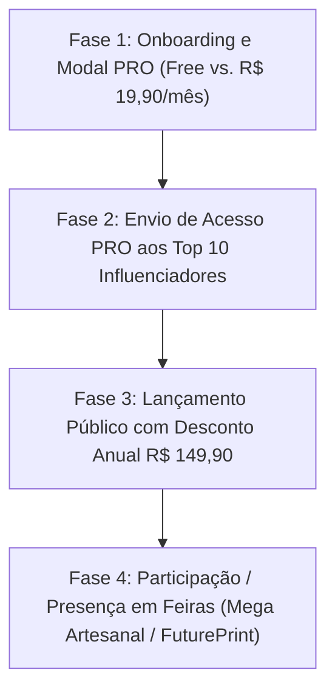

# Craftool Studio — Plano Diretor de Estratégia de Negócios, Arquitetura Open Core, Precificação e Marketing de Influência

**Data:** 2026-08-05  
**Status:** Especificação Estratégica Completa & Plano Go-To-Market (GTM)  
**Sistema:** Craftool Studio PWA (Vite/TypeScript) & `craftools_api` (PHP/MySQL)

---

## 1. Posicionamento Estratégico do Produto

### O que o Craftool Studio NÃO é:
O Craftool Studio **NÃO é um substituto genérico do Canva**. Ele não foi projetado para criar posts de Instagram, banners digitais ou artes genéricas para redes sociais.

### O que o Craftool Studio É:
O Craftool Studio é o **Hub Definitivo de Produtividade, Automação, Fechamento de Arquivos e Pré-Impressão (Prepress)** focado exclusivamente em **Gráficas Rápidas, Copiadoras e Papelarias Personalizadas (Encadernação, Scrapbook e Brindes)**.

> **Proposta Única de Valor (UVP):**  
> *"Todas as ferramentas especializadas para preparação de arquivos, geração de miolos e automação de impressão que o Canva não possui, por menos da metade do preço."*

---

## 2. Estratégia de Rebranding e Segurança do Código-Fonte

Para adotar o nome comercial **Craftool Studio** com 100% de segurança técnica:

### A. Abordagem de Rebranding de Marca (Recomendada — Risco 0%)
- **Interface Pública & UI**: Alteração de títulos (`<title>Craftool Studio</title>`), logos, cabeçalhos, PWA Manifest (`"Craftool Studio"`) e `package.json` (`"name": "craftool-studio"`).
- **Código-Fonte Interno**: Os identificadores internos como `<craftools-element>`, CustomEvents (`craftools-element-select`), atributos `_craftoolsMeta` e chaves do `localStorage` **permanecem intactos por baixo dos panos**.
- **Resultado**: Risco 0% de quebra de compatibilidade com projetos antigos salvos em JSON ou instabilidade de Web Components.

---

## 3. Modelo Open Source & Arquitetura Open Core

Adotar o modelo **Open Core (Código Aberto com Recursos em Nuvem)** é a alavanca de crescimento mais poderosa para o Craftool Studio, construindo confiança total na comunidade e tração viral.

### A. Divisão da Licença e Repositórios (AGPL-3.0 / FSL)
- **Licença Recomendada**: **AGPL-3.0 (GNU Affero General Public License)**.
- **Proteção de Negócio**: Permite que artesãs, estudantes e pequenos estúdios usem e modifiquem o código de graça, mas **obriga** que qualquer empresa concorrente que tente subir o código como serviço em nuvem abra 100% das modificações, impedindo que grandes empresas roubem a tecnologia em segredo.

### B. Matriz Open Source vs. PRO/Cloud

| Camada do Sistema | 🔓 Open Source (Gratuito no GitHub) | 🔒 Premium / Cloud PRO (Proprietário) |
| :--- | :--- | :--- |
| **Motor do Editor (Canvas)** | Edição básica de texto, formas, imagens, zoom e manipulação de objetos na tela. | **Exportação PDF Vetorial Print-Ready (CMYK/Corte)** e gerador de marcas de sangria/dobra. |
| **Gerador de Agendas (`GeneratorTool`)** | Criação de calendários simples de 1 página. | **Gerador Completo de 365 Dias**, feriados nacionais, fases da lua e presets de miolos prontos. |
| **Dados Variáveis (VDP)** | Pré-visualização de 1 registro por vez. | **Processamento em Lote (CSV/Excel)**: Exportação de 500 crachás/cadernos de uma só vez. |
| **Imposição de Folha (Grid)** | Encaixe básico manual de elementos. | **Montagem Automática N-Up em A4/SRA3** com marcas de guilhotina e otimização de papel. |
| **Melhoria de Imagem (`ImageEnhancer`)** | Sliders manuais de brilho e contraste. | **Algoritmo de Referência Color Grading (IA/Canvas)** e perfis automáticos de cor. |
| **Armazenamento & Nuvem** | Salva apenas no `localStorage` do navegador do usuário. | **Backup Automático na Nuvem**, sincronização entre dispositivos e biblioteca de ativos HD. |

---

## 4. O Papel da `craftools_api` no Modelo Open Core

A **`craftools_api` (Backend PHP/MySQL)** é mantida como um repositório **proprietário/fechado** hospedado exclusivamente na nuvem oficial (`api.craftoolstudio.com`).

```
┌────────────────────────────────────────────────────────────────────────┐
|                      CRAFTOOL STUDIO PWA (Frontend)                    |
└───────────────────────────────────┬────────────────────────────────────┘
                                    │
               ┌────────────────────┴────────────────────┐
               │                                         │
               ▼ (Modo Desconectado / Self-Hosted)       ▼ (Modo Conectado / SaaS PRO)
┌────────────────────────────────────────┐   ┌───────────────────────────────────┐
│ • Salva projetos no LocalStorage       │   │ • Conecta via JWT à craftools_api │
│ • Assets locais básicos                │   │ • Backup na Nuvem Automático      │
│ • Uso individual gratuito              │   │ • Catálogo de Templates HD        │
│ • Custo de servidor ZERO para o app    │   │ • Validação de Plano PRO          │
│                                        │   │ • Stream Seguro de Módulos (Blob) │
│                                        │   │ • Checkout Mercado Pago / Stripe  │
└────────────────────────────────────────┘   └───────────────────────────────────┘
```

1. **Autenticação & Token JWT**: Valida requisições e claims de plano (`plan: 'pro'`).
2. **Biblioteca de Ativos na Nuvem**: Servidor CDN de templates de agendas, backgrounds HD, overlays e fontes.
3. **Módulos PRO Invioláveis (Zero-Trust)**: Envia dinamicamente os módulos de processamento pago via token efêmero dinâmico (`vector-pdf-pro-[TOKEN].js`), executado via Blob em memória.
4. **Gateway de Pagamentos**: Processa assinaturas recorrentes via Mercado Pago, Stripe ou Asaas.
5. **Custo Nulo de Servidor para Usuários Free**: Quem roda a versão aberta usa apenas o armazenamento local do seu próprio navegador — você não gasta servidor com usuários que não pagam.

---

## 5. Público-Alvo e Personas

### Persona A: Papelaria Personalizada & Encadernação Criativa
- **Perfil**: Empreendedoras(os) que produzem agendas, planners, cadernos corporativos, álbuns de fotos, topos de bolo e lembrancinhas.
- **Dores Principais**:
  - Perda de horas desenhando manualmente miolos de agendas (365 dias/semanas) ou alinhando calendários.
  - Dificuldade para criar gabaritos com medidas exatas em milímetros (mm) e margens de sangria/segurança para corte.
  - Demora para produzir pedidos em lote com dados variáveis (ex: 50 cadernos escolares com nomes diferentes dos alunos).

### Persona B: Gráficas Rápidas & Balcões de Impressão
- **Perfil**: Pequenos e médios estabelecimentos de impressão sob demanda (cartões de visita, crachás, convites, panfletos, carimbos).
- **Dores Principais**:
  - Arquivos enviados por clientes sem sangria, em baixa resolução ou com cores fora do padrão.
  - Perda de tempo montando grades de impressão manualmente (encaixar 10 cartões ou 24 adesivos numa folha A4/A3 com marcas de corte).

---

## 6. Precificação Super Acessível (Menos da Metade do Canva Pro)

Para garantir adesão massiva e zero fricção financeira para microempreendedores:

### Tabela Comparativa de Planos

| Plano | Valor | Preço Equivalente/Mês | Comparativo com Canva Pro |
| :--- | :---: | :---: | :---: |
| **Free (Gratuito)** | **R$ 0,00** | R$ 0,00 | Recursos básicos, marca d'água discreta nos PDFs |
| **PRO Mensal** | **R$ 19,90 / mês** | R$ 19,90 / mês | **~43% mais barato que o Canva Pro** |
| **PRO Semestral** | **R$ 89,90 / semestre** | R$ 14,98 / mês | *(Opção intermediária de conversão)* |
| **PRO Anual (Melhor Valor)** | **R$ 149,90 / ano** | **R$ 12,49 / mês** | **~48% mais barato que o Canva Pro** |

### Vantagens da Precificação:
1. **Mental Anchor de "Menos de R$ 20/mês"**: Preço de compra por impulso sem barreira orçamentária.
2. **Fluxo de Caixa Antecipado (Upfront Cashflow)**: O valor anual de R$ 149,90 (R$ 12,49/mês) estimula a maioria a assinar o plano anual, injetando capital para reinvestimento no produto sem necessidade de investidores iniciais.
3. **Recuperação de Investimento pelo Cliente**: O custo do plano PRO mensal (R$ 19,90) é pago com o lucro de **apenas 1 caderno ou agenda vendida** no mês.

---

## 7. Diretório de Influenciadores para Lançamento e Abordagem

### A. Referências em Papelaria Personalizada & Encadernação

1. **Thiara Ney (`@estudiotuty` / *Tuty por Thiara Ney*)** — YouTube, Instagram, TikTok.
2. **Lidiane Severiano (`@lidianeseveriano`)** — YouTube, Instagram.
3. **Fernanda Holanda (*Blog Papelaria Personalizada*)** — YouTube, Blog, Instagram.
4. **Camila Camargo (`@camilacamargo.oficial`)** — YouTube, Instagram.
5. **Nilmara Quintela (`@nilmaraquintela`)** — Instagram, YouTube.

### B. Referências em Gráfica Rápida & Balcão de Impressão

1. **Gráfica Linha Criativa** — YouTube.
2. **Play na Gráfica** — YouTube.
3. **Pah Personalizados (`@pahpersonalizados`)** — TikTok, YouTube, Instagram.
4. **Versão Criativa** — YouTube, Instagram.

---

### Template de Abordagem (Pitch em DM / E-mail Comercial)

> **Assunto:** Parceria & Acesso PRO ao Craftool Studio (Hub para Papelaria e Gráfica)
>
> Olá **[Nome]**, tudo bem? Acompanho seu trabalho com **[papelaria personalizada / encadernação / gráfica rápida]** e admiro muito o conteúdo que você compartilha!
>
> Estou lançando o **Craftool Studio**, uma plataforma 100% web criada especificamente para resolver as dores reais de quem produz e imprime (geração automática de miolos de agendas/planners completos em 1 clique, fechamento de PDF vetorial com sangria/marcas de corte e motor de dados variáveis para crachás/cadernos em lote).
>
> Como você é uma grande autoridade nesse mercado, gostaria de te dar uma **conta PRO vitalícia gratuita** para você testar a ferramenta e me dar o seu feedback.
>
> Topa dar uma olhada sem compromisso? Se curtir, te envio o link de acesso direto!

---

## 8. Eventos, Congressos e Feiras Recomendadas

1. **Mega Artesanal (São Paulo - Expo São Paulo)**: Maior evento de artesanato e papelaria personalizada da América Latina.
2. **FuturePrint (São Paulo - Expo Center Norte)**: Maior feira de impressão digital e gráfica rápida da América Latina.
3. **FESPA Brasil (São Paulo)**: Feira técnica de soluções gráficas sob demanda.

---

## 9. Roadmap de Execução Go-To-Market


