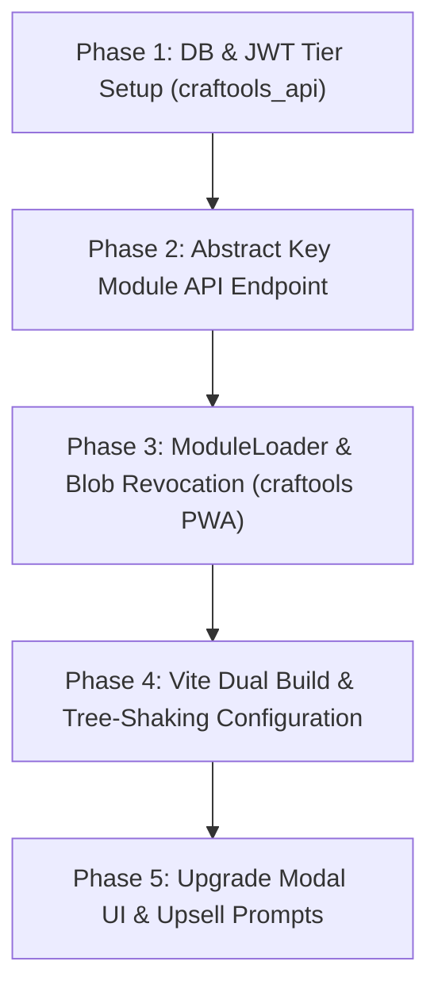

# Zero-Trust Premium Architecture and Dynamic Module Protection Report

**Date:** 2026-08-05  
**Status:** Architectural Specification — Ready for Implementation  
**System:** Craftools PWA (Vite/TypeScript) & `craftools_api` (PHP/MySQL)

---

## Executive Summary

Providing Premium vs. Free features in a client-side Progressive Web Application (PWA) like **Craftools** presents a unique security challenge. Because code executed in the browser can be inspected, manipulated, or overridden via Developer Tools, **pure client-side feature flags are completely insecure**.

Adhering to the **Zero-Trust Principle ("Never Trust the Client")**, this specification details an end-to-end architecture that guarantees:
1. **Zero Path Exposure**: Client requests use abstract resource keys (e.g., `resource: "vector-pdf-pro"`), exposing no internal server filesystem paths or file structures.
2. **User-Scoped & Ephemeral Module Bundles**: Dynamic modules are delivered as user-bound, token-signed scripts (`vector-pdf-pro-[USER_TOKEN].js` or authenticated Blobs) that only run for the specific authenticated session.
3. **Physical Source Code Exclusion (Tree-Shaking)**: Free production builds physically omit Premium module source code from the client JavaScript bundle.
4. **Server-Side Entitlement Verification**: The `craftools_api` backend enforces strict JWT signature and plan checks on all assets, templates, and dynamic modules.

---

## 1. Threat Model & Vulnerabilities in Client-Side PWAs

| Vulnerability | Attack Vector | Zero-Trust Mitigation |
| :--- | :--- | :--- |
| **DevTools State Mutation** | User edits `localStorage.setItem('user_plan', 'pro')` or overrides `PlanManager.isPro = () => true` in browser console. | Features require server-delivered assets & dynamic modules. Client state overrides fail because server signature validation rejects unauthenticated requests. |
| **Source Code Reverse Engineering** | Free build includes Premium source code (e.g., vector PDF export algorithm). User un-hides UI buttons and invokes internal JS functions directly. | Vite build-time tree-shaking removes Premium source code from Free builds. Stubs replace Premium modules. |
| **Path Traversal & Resource Scraping** | Network requests expose direct file paths (e.g., `/modules/pdf-vector.js`). Attacker downloads files directly or probes paths. | **Abstracted Resource Keys**: Client requests `resource: "vector-pdf-pro"`. Paths are mapped internally on the server. |
| **Token Replay / License Sharing** | Pro user downloads a dynamic module script and shares the `.js` file with Free users. | **User-Scoped Ephemeral Tokens**: Delivered scripts are bound to `USER_TOKEN` + Session IP + Expiration, rendering shared files execution-locked or invalid. |

---

## 2. Architecture Overview & Core Components

```
+-----------------------------------------------------------------------------------+
|                                 CRAFTOOLS PWA                                     |
|                                                                                   |
|  +--------------------+     Click Premium Tool     +---------------------------+  |
|  |   ToolRegistry     | -------------------------> |    ModuleLoader.ts        |  |
|  | (Abstract Keys)    |                            |  req: "vector-pdf-pro"    |  |
|  +--------------------+                            +---------------------------+  |
+------------------------------------------------------------------|----------------+
                                                                   |
                                          HTTP POST /api/v1/access | (Header: Authorization JWT)
                                                                   v
+-----------------------------------------------------------------------------------+
|                                CRAFTOOLS_API (PHP)                                |
|                                                                                   |
|  1. Validate JWT Signature & User Plan in DB (users.plan == 'pro')                |
|  2. Map Resource Key ("vector-pdf-pro") -> Server Private Module Path             |
|  3. Generate Ephemeral Token: TOKEN = HMAC_SHA256(user_id + session_id + secret)  |
|  4. Serve User-Scoped Stream: vector-pdf-pro-[TOKEN].js                           |
+------------------------------------------------------------------|----------------+
                                                                   |
                                          HTTP 200 OK              | (JS Payload / Blob)
                                                                   v
+-----------------------------------------------------------------------------------+
|  5. ModuleLoader evaluates script Blob & registers dynamic tool instance.          |
+-----------------------------------------------------------------------------------+
```

---

## 3. Abstracted Resource Invocation (Zero Path Exposure)

To prevent revealing internal directory structures, server endpoints, or filename conventions:

### Client-Side Request Format
The client **never** specifies file paths or URLs. It passes only a short, abstract resource key:

```typescript
// craftools/utils/ModuleLoader.ts
export class ModuleLoader {
  static async loadPremiumModule(resourceKey: string): Promise<any> {
    const token = AuthManager.getToken();
    
    // Abstract request -- NO file paths, NO directory structures exposed
    const response = await fetch('/api/v1/module/access', {
      method: 'POST',
      headers: {
        'Content-Type': 'application/json',
        'Authorization': `Bearer ${token}`
      },
      body: JSON.stringify({ resource: resourceKey }) // e.g. { resource: "vector-pdf-pro" }
    });

    if (!response.ok) {
      if (response.status === 403) {
        throw new Error('PREMIUM_REQUIRED');
      }
      throw new Error('MODULE_LOAD_FAILED');
    }

    const data = await response.json();
    // Returns user-scoped single-use URL & token descriptor
    return ModuleLoader._importScopedModule(data.moduleUrl, data.scopedToken);
  }
}
```

### Server-Side Key Mapping (`craftools_api/src/ModuleRepository.php`)
The server maintains a private, non-public mapping of abstract keys to internal code files:

```php
// craftools_api/src/ModuleRepository.php
class ModuleRepository {
    private static $MODULE_MAP = [
        'vector-pdf-pro'    => __DIR__ . '/../private_modules/PdfVectorExport.module.php',
        'image-enhance-pro' => __DIR__ . '/../private_modules/ImageEnhancerPro.module.php',
        'album-wizard-pro'  => __DIR__ . '/../private_modules/AlbumWizardPro.module.php',
    ];

    public static function resolvePath(string $resourceKey): ?string {
        return self::$MODULE_MAP[$resourceKey] ?? null;
    }
}
```

---

## 4. User-Scoped & Ephemeral Module Delivery (`vector-pdf-pro-[USER_TOKEN].js`)

To prevent users from extracting dynamic JavaScript files and re-distributing them:

### A. Ephemeral Token Generation (Server Side)
When a PRO user requests a module, `craftools_api` constructs a single-use token tied to the user's ID, session, and current timestamp:

$$\text{USER\_TOKEN} = \text{HMAC-SHA256}\Big(\text{user\_id} \mathbin{\Vert} \text{session\_id} \mathbin{\Vert} \text{timestamp}, \; \text{SERVER\_SECRET}\Big)$$

The response headers set `Content-Type: application/javascript` and set a custom header filename:
`Content-Disposition: inline; filename="vector-pdf-pro-a7f9b8c3d2e1.js"`

### B. User-Bound Script Execution (Client Side)
`ModuleLoader.ts` executes the fetched script in memory via Blob URL, ensuring no persistent local file or script tag remains in the DOM:

```typescript
private static async _importScopedModule(blobContent: string, scopedToken: string): Promise<any> {
  // Wrap module content in Blob URL for secure execution
  const blob = new Blob([blobContent], { type: 'application/javascript' });
  const objectUrl = URL.createObjectURL(blob);

  try {
    const module = await import(/* @vite-ignore */ objectUrl);
    return module;
  } finally {
    // Immediately revoke Object URL so it cannot be re-downloaded or inspected via memory URL
    URL.revokeObjectURL(objectUrl);
  }
}
```

---

## 5. Dual Build & Tree-Shaking Strategy (Vite / Rollup)

To guarantee that Free builds contain **zero** Premium source code:

### Build Configurations

1. **Free Production Build (`npm run build:free`)**:
   - `VITE_APP_TIER=free`
   - Premium modules (`PdfVectorExport.ts`, `ImageEnhancer.ts` algorithms) are replaced with **Stub Implementations** during Vite compilation via `vite-plugin-replace` or alias mapping.
   - The compiled JavaScript bundle physically contains no Premium code.

2. **PRO Production Build / PWA Bundle (`npm run build:pro`)**:
   - `VITE_APP_TIER=pro`
   - Includes full module code and dynamic dynamic import chunks.

### Stub Replacement Example

```typescript
// craftools/stubs/PdfVectorExportStub.ts (Included in Free build)
export class PdfVectorExport {
  static async exportToPdf(): Promise<never> {
    // Show Upgrade Modal
    document.dispatchEvent(new CustomEvent('craftools-show-upgrade-modal', {
      detail: { feature: 'vector-pdf' }
    }));
    throw new Error('Feature locked in Free tier.');
  }
}
```

---

## 6. Server-Side Entitlement & Database Enforcement (`craftools_api`)

### Database Schema Expansion (`schema.sql`)

```sql
-- Expansion of users table for tier management
ALTER TABLE users ADD COLUMN plan VARCHAR(20) NOT NULL DEFAULT 'free';
ALTER TABLE users ADD COLUMN plan_expires_at DATETIME NULL;

-- Audit log for premium feature requests
CREATE TABLE IF NOT EXISTS feature_access_logs (
    id INT AUTO_INCREMENT PRIMARY KEY,
    user_id INT NOT NULL,
    resource_key VARCHAR(50) NOT NULL,
    granted TINYINT(1) NOT NULL,
    ip_address VARCHAR(45) NOT NULL,
    created_at TIMESTAMP DEFAULT CURRENT_TIMESTAMP,
    FOREIGN KEY (user_id) REFERENCES users(id) ON DELETE CASCADE
) ENGINE=InnoDB DEFAULT CHARSET=utf8mb4;
```

### JWT Entitlement Payload
The JWT token issued by `craftools_api` upon login contains verified server-side claims:

```json
{
  "sub": 1042,
  "email": "user@domain.com",
  "plan": "pro",
  "plan_expires": 1799884800,
  "iss": "craftools-api",
  "iat": 1785868800
}
```

When any request for a Premium asset, background, template, or dynamic module arrives, `craftools_api` validates:
1. JWT Signature using the server's private secret key.
2. `plan === 'pro'` AND `plan_expires > NOW()`.
3. If invalid, returns `HTTP 403 Forbidden` with body `{ "error": "SUBSCRIPTION_REQUIRED" }`.

---

## 7. Step-by-Step Implementation Roadmap



### Phase 1: DB & JWT Tier Setup (`craftools_api`)
- Add `plan` column to `users` table in `schema.sql`.
- Update `repo.php` / Auth endpoint to include `plan` claim in JWT payload.

### Phase 2: Abstract Key Module API Endpoint
- Create endpoint `POST /api/v1/module/access`.
- Implement `ModuleRepository.php` key-to-path mapping.
- Add user-scoped token generation (`vector-pdf-pro-[TOKEN].js`).

### Phase 3: ModuleLoader & Execution Safety (`craftools`)
- Implement `ModuleLoader.ts` in PWA.
- Implement Blob URL dynamic import and immediate `URL.revokeObjectURL()` cleanup.

### Phase 4: Vite Dual Build & Stubbing
- Configure `vite.config.ts` with environment alias replacements for `npm run build:free`.

### Phase 5: Upgrade UX & Upsell Modal
- Create standard system modal `UpgradeModal.ts` displaying PRO benefits when a user interacts with locked features.

---

## 8. Summary of Security Guarantees

1. **Zero Path Exposure**: No client request contains server path strings like `/api/v1/modules/vector-pdf-pro.js`. Requests use abstract keys like `"vector-pdf-pro"`.
2. **Zero Client Trust**: DevTools modifications (`localStorage` or JS variable overrides) cannot grant access because server-side JWT verification blocks data and module delivery.
3. **No File Sharing / Leaks**: Dynamic scripts are delivered with single-use tokens (`vector-pdf-pro-[USER_TOKEN].js`), executed via Blob in memory, and instantly revoked from memory URLs.
4. **Clean Codebase**: Maintainable via single repository structure with Vite build-time feature toggling.
